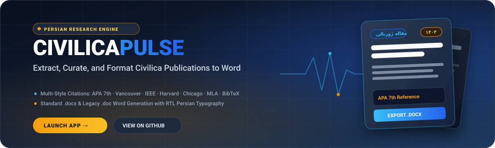
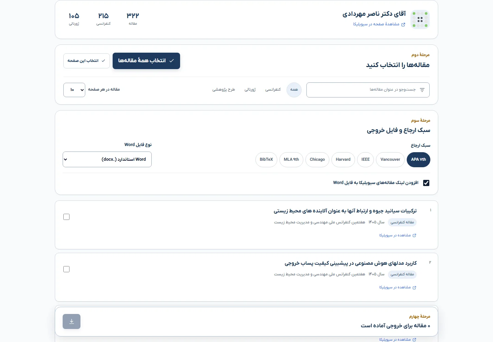

<div align="center">



# <picture><source media="(prefers-color-scheme: dark)" srcset="https://api.iconify.design/solar:document-text-linear.svg?color=%2338BDF8"><source media="(prefers-color-scheme: light)" srcset="https://api.iconify.design/solar:document-text-linear.svg?color=%231E3A5F"></picture> CIVILICAPULSE
### **Extract, Curate, and Export Civilica Researcher Publications into Word Citations.**

[](https://soheil-aghayani.github.io/CivilicaPulse/)
[](#)
[](#)
[](#)

<br/>

<p align="center">
  <picture>
    <source media="(prefers-color-scheme: dark)" srcset="https://readme-typing-svg.demolab.com?font=Plus+Jakarta+Sans&weight=600&size=23&pause=1000&color=38BDF8&center=true&vCenter=true&width=860&lines=Automated+Civilica+Researcher+Publication+Extractor;Multi-Style+Citations:+APA+7th,+Vancouver,+IEEE,+Harvard,+Chicago,+MLA,+BibTeX;Formatted+Word+Export+with+Standard+.docx+%26+Legacy+.doc;Native+RTL+Persian+Typography+with+B+Nazanin+%26+Times+New+Roman;Zero-Auth,+Zero-Cost,+and+100%25+Privacy-Preserving">
    <source media="(prefers-color-scheme: light)" srcset="https://readme-typing-svg.demolab.com?font=Plus+Jakarta+Sans&weight=600&size=23&pause=1000&color=1E3A5F&center=true&vCenter=true&width=860&lines=Automated+Civilica+Researcher+Publication+Extractor;Multi-Style+Citations:+APA+7th,+Vancouver,+IEEE,+Harvard,+Chicago,+MLA,+BibTeX;Formatted+Word+Export+with+Standard+.docx+%26+Legacy+.doc;Native+RTL+Persian+Typography+with+B+Nazanin+%26+Times+New+Roman;Zero-Auth,+Zero-Cost,+and+100%25+Privacy-Preserving">
    
  </picture>
</p>

<p align="center">
  <b>A high-performance Persian academic research tool engineered to extract publications from Civilica researcher profiles, curate and filter records, and export standardized Word bibliographies with authentic Persian typography.</b>
</p>

</div>

---

## سیویلیکاپالس (CivilicaPulse) چیست؟

**CivilicaPulse** یک ابزار پژوهشی مستقل و بدون هزینه برای جامعهٔ علمی و پژوهشگران فارسی‌زبان است. این سامانه با دریافت نشانی صفحهٔ عمومی پژوهشگر در [سیویلیکا (Civilica)](https://civilica.com)، اطلاعات مقالات نمایه‌شده (عنوان، سال، نوع مقاله، محل انتشار و لینک) را استخراج کرده و امکان گزینش، پالایش و دریافت خروجی استاندارد Word با سبک‌های استنادی معتبر را فراهم می‌سازد:

- 🌐 [ورود به وب‌سایت CivilicaPulse](https://soheil-aghayani.github.io/CivilicaPulse/)
- 💻 [مخزن کد پروژه در GitHub](https://github.com/Soheil-Aghayani/CivilicaPulse)
- 🔬 [سامانهٔ مرتبط ScholarPulse](https://soheil-aghayani.github.io/ScholarPulse/)
- 👨‍💻 [پورتفولیوی رسمی سهیل آقایانی](https://soheil-aghayani.github.io/)

این ریپازیتوری شامل رابط کاربری راست‌به‌چپ (منتشرشده روی GitHub Pages) و موتور پردازش و ساخت اسناد Word مبتنی بر Python Flask است.

<p align="center">
  
</p>

---

## <picture><source media="(prefers-color-scheme: dark)" srcset="https://api.iconify.design/solar:layers-linear.svg?color=%2338BDF8"><source media="(prefers-color-scheme: light)" srcset="https://api.iconify.design/solar:layers-linear.svg?color=%231E3A5F"></picture> PLATFORM FEATURES & ARCHITECTURE

| Feature | Researcher Experience | Underlying Architecture |
| :--- | :--- | :--- |
| ** Persian RTL UI/UX** | Native right-to-left layout styled with **IRANYekanX** typography, smooth pagination, responsive mobile controls, and persistent visual avatars (Jdenticon). | Pure HTML5 and Vanilla CSS with zero heavy frameworks, custom CSS variables, and zero runtime dependencies. |
| ** Multi-Style Citation Engine** | Instant formatting into APA 7th, Vancouver, IEEE, Harvard, Chicago, MLA 9th, and BibTeX styles for both Persian and English publications. | Centralized citation parsing engine (`citation_formats.py`) with strict punctuation and locale-aware author rules. |
| ** Word (.docx / .doc) Styler** | Generates true Microsoft Word documents formatted with **B Nazanin (12pt)** for Persian and **Times New Roman (11pt)** for English with Persian digits. | Native `python-docx` XML generator with explicit `<w:bidi/>` run properties and backward-compatible HTML/Word MIME support. |
| ** Resilient Dual Ingestion** | Fetch directly via profile URL (e.g. `https://civilica.com/p/176225/`) or paste local HTML source if network or bot restrictions arise. | BeautifulSoup4 DOM parser with regex normalization and defensive fallback heuristics. |
| ** Zero-Auth & Privacy First** | No logins, no database persistence, no API keys, and no AI tracking. Your academic research stays private. | Completely stateless microservice architecture; data is processed in-memory and discarded upon export. |

---

## <picture><source media="(prefers-color-scheme: dark)" srcset="https://api.iconify.design/solar:code-linear.svg?color=%2338BDF8"><source media="(prefers-color-scheme: light)" srcset="https://api.iconify.design/solar:code-linear.svg?color=%231E3A5F"></picture> DIRECTORY STRUCTURE & MANAGEMENT

The repository is modularly divided into a static front-end layer and a Python-powered export service:

```yaml
📦 CivilicaPulse
 ┣ 📂 web/                  # Static web application (GitHub Pages deploy target)
 ┃ ┣ 📂 assets/            # Brand marks, IRANYekanX fonts, and SVG icons
 ┃ ┣ 📜 app.js             # Client logic, article filtering, selection, and API bridge
 ┃ ┣ 📜 config.js          # API endpoint config (localhost vs Cloudflare Worker)
 ┃ ┣ 📜 favicon.svg        # Modern SVG favicon
 ┃ ┣ 📜 index.html         # Accessible RTL semantic markup
 ┃ ┗ 📜 styles.css         # Institutional theme styles with IRANYekanX webfonts
 ┣ 📂 tests/                # Automated regression test suite
 ┃ ┣ 📜 test_parser.py     # DOM parsing verification
 ┃ ┗ 📜 test_citations.py  # Citation formatter and Word XML export tests
 ┣ 📂 docs/                 # Documentation assets and SVG vector hero banner
 ┣ 📂 cloudflare/           # Cloudflare Worker bridge for the Python API
 ┣ 📜 server.py             # Flask microservice & Word document generator
 ┣ 📜 civilica_parser.py    # Robust scraper & HTML parser
 ┣ 📜 citation_formats.py   # APA, IEEE, Vancouver, Harvard, Chicago formatters
 ┣ 📜 render.yaml           # Render origin service deployment
 ┣ 📜 start.bat             # Instant Windows one-click local development launcher
 ┣ 📜 requirements.txt      # Python dependencies (Flask, beautifulsoup4, python-docx)
 ┗ 📜 README.md             # Platform documentation & technical manual
```

---

## Production API routing

The static interface is published on GitHub Pages. Production API requests use the public Cloudflare Worker bridge below, which forwards only `/api/*` requests to the Flask origin service on Render:

`https://civilicapulse-api-bridge.soheil-deutschly.workers.dev`

This keeps browser traffic on a Cloudflare endpoint while preserving the existing Python parser and Word export implementation.

---

## <picture><source media="(prefers-color-scheme: dark)" srcset="https://api.iconify.design/solar:file-text-linear.svg?color=%2338BDF8"><source media="(prefers-color-scheme: light)" srcset="https://api.iconify.design/solar:file-text-linear.svg?color=%231E3A5F"></picture> WORD EXPORT SPECIFICATIONS

The output document formatting follows Iranian academic publication standards:

| Property | Rule / Specification | Description |
| :--- | :--- | :--- |
| **Document Direction** | Right-to-Left (RTL) | Default paragraph orientation is right-aligned RTL |
| **Persian Typography** | `B Nazanin`, 12 pt | Applied to all Persian text runs with `<w:cs>` definition |
| **Latin / English Text**| `Times New Roman`, 11 pt | Applied to English authors, titles, DOIs, and venues |
| **Numeral Localization**| Persian (`۰۱۲۳۴۵۶۷۸۹`) | Publication years and citation index numbers are Persian |
| **Hyperlinks / URLs**   | Latin (`0-9`), Unaltered | URLs and DOIs preserve English digits and clickability |
| **Standard File Format**| `.docx` (Office Open XML) | Modern Word standard with native XML styling |
| **Legacy File Format**  | `.doc` (Word-Compatible) | High compatibility mode for legacy academic workflows |

---

## <picture><source media="(prefers-color-scheme: dark)" srcset="https://api.iconify.design/solar:play-circle-linear.svg?color=%2338BDF8"><source media="(prefers-color-scheme: light)" srcset="https://api.iconify.design/solar:play-circle-linear.svg?color=%231E3A5F"></picture> GETTING STARTED & LOCAL EXECUTION

### Option 1: One-Click Windows Launcher
Double-click [`start.bat`](file:///d:/Programming/01%20-%20Web%20Projects/Civilica%20Paper%20Extractor/start.bat) to automatically initialize the virtual environment, install dependencies, and launch the server.

### Option 2: Manual PowerShell Setup
```powershell
# 1. Navigate to the project root
cd "01 - Web Projects\Civilica Paper Extractor"

# 2. Create and activate a virtual environment
py -m venv .venv
.\.venv\Scripts\Activate.ps1

# 3. Install dependencies
pip install -r requirements.txt

# 4. Start the server
python server.py
```
Open **[http://127.0.0.1:5000](http://127.0.0.1:5000)** in your browser.

### Automated Test Suite
Run the full test suite verifying HTML parsing, citation formatting, and Word generation:
```powershell
python -m unittest discover -s tests -v
```

---

## <picture><source media="(prefers-color-scheme: dark)" srcset="https://api.iconify.design/solar:user-circle-linear.svg?color=%2338BDF8"><source media="(prefers-color-scheme: light)" srcset="https://api.iconify.design/solar:user-circle-linear.svg?color=%231E3A5F"></picture> DEVELOPER & CREDITS

**Soheil Aghayani**
- 🎓 **M.Sc. in Environmental Engineering** – University of Tehran
- 💻 **Interests**: Sustainability Systems, Academic Tools, Web Architectures, Python
- 📧 **Email**: soheyl.aghayani+github@gmail.com
- 🔗 **LinkedIn**: [linkedin.com/in/AgSeyl](https://linkedin.com/in/AgSeyl)
- 🐙 **GitHub**: [@Soheil-Aghayani](https://github.com/Soheil-Aghayani)

---
<div align="center">
  <sub>Crafted with precision for Iranian researchers and academia. Released under the MIT License.</sub>
</div>
